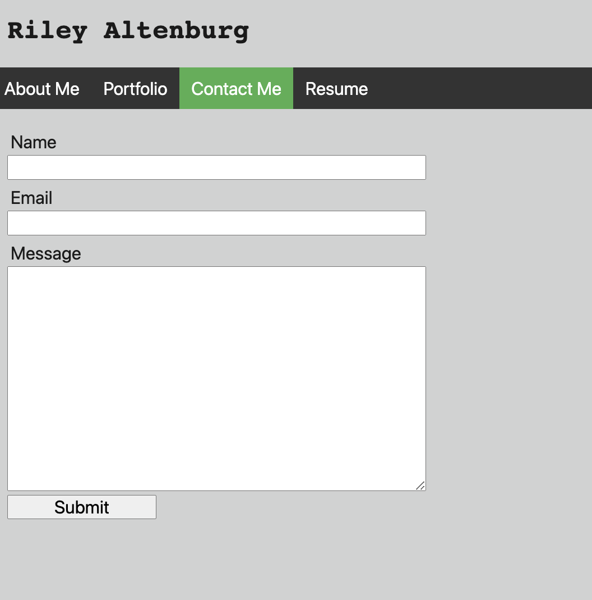
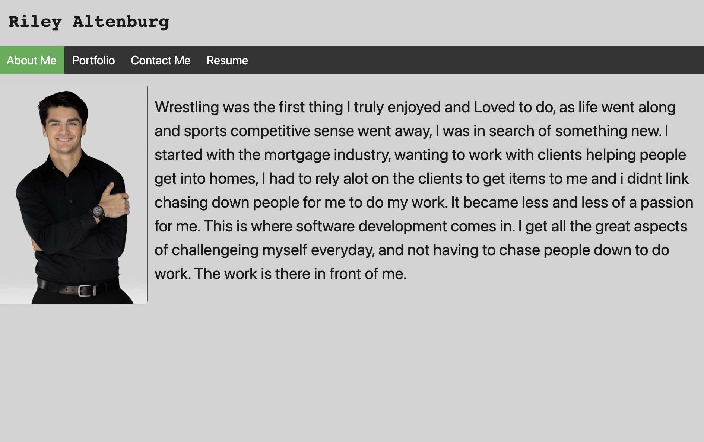

# reactPortfolio

### Author

Riley Altenburg

If you'd like to connect me, please email RileyAltenburg@gmail.com. I'd love to answer any questions and improve where I can.

### GitHub Information

Find my Repository information here at: https://github.com/RileyAlt/reactPortfolio

### Description

My Motivation for the project was to challenge and display my skills to potential employers. It also is a great place for people to connect wiht me and can help further my knowledge.

The project was built to showcase what I have learned, accomplished and applied to real life problems or needs.

What I gained from this project was an increase in understanding of React, as well as as ability to express some of my creative side.

### Installation

To run this locally, clone the repo and then run

```
cd react-mod && npm i && npm run start
```

This will install all package dependencies and start your local server.

### Usage

Below are some screenshots of the application




### Licensing

MIT License
